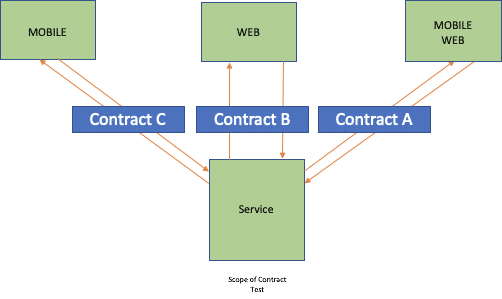
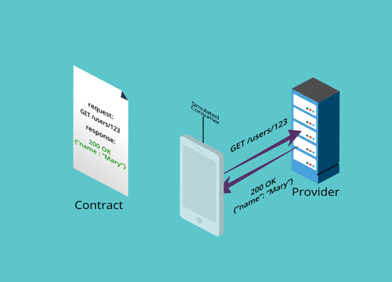
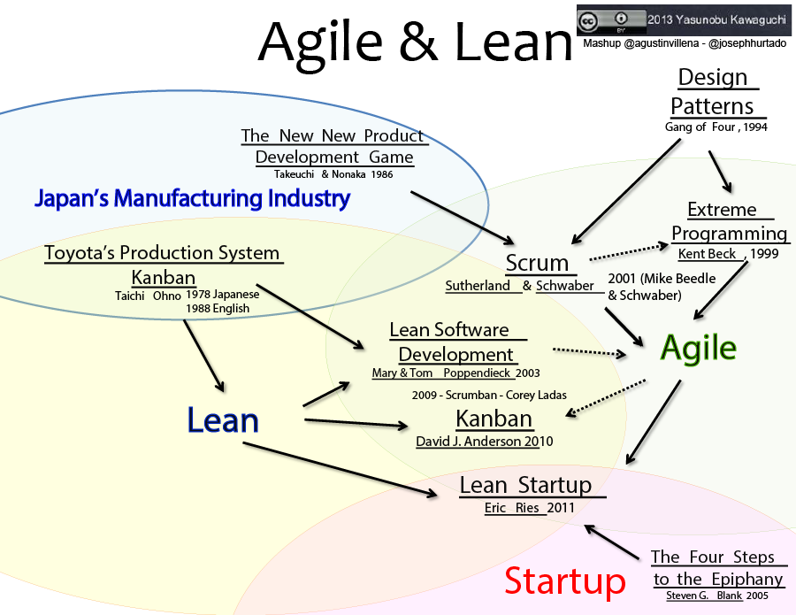

# Pact를 이용한 Consumer Driven Contract Test

## 오늘날의 Web System 개발에 나타나는 문제점

- Sprint가 점차 지남에 따라 API를 사용, 제공하는 측의 명세가 점차 달라지는 현상이 발생
- 하나의 API를 식별하기 어려울 정도로 다양한 서비스가 이용 (Micro-Services Architecture)
- API의 작은 변경이 운영을 멈추게 할 수 있는 상황이 도래 (Agile에서는 동작하는 소프트웨어를 지속적으로 제공해야한다)

## Consumer Driven Contract Test가 해결해 줌

> Consumer Driven Contract(CDC) Test란?
> API 명세에 대한 요청을 API를 사용하는 쪽에서 먼저 제시하고
> API를 제공하는 쪽에서 이에 맞추어 개발해나가는 Contract를 대상으로한 TDD 개발 방식

- API가 변경되면 알 수 있다.
- API를 사용하는 쪽과 제공하는 쪽의 명세를 개발할 때 쉽게 맞출 수 있다. (Shift Left)
- API 변경을 소프트웨어를 장애 없이 진행할 수 있다. (Agile/Scrum)
- 사용하지 않는 API 개발을 줄일 수 있다. (Lean)

## 적합한 대상 시스템

- Agile/Scrum/XP를 개발 방식을 가진 시스템
- Front-End 와  Back-End 로 나뉘어진 웹 시스템
- PC, Mobile, Tablet 등 다양한 단말기와 연결되는 시스템
- 내부 서비스간 API 통신이 많은 시스템
- 글로벌로 서비스를 제공하는 시스템

## 도입을 고려할 상황

- Consumer Driven이 안되는 개발 프로세스일 경우 (API를 먼저 개발하는 전통적인 개발 방법)
- 후행으로 3자가 Contract Test 코드를 개발하려는 경우
- API 사용이 1:1 사용되고 변경이 거의 없는 경우

## Contract를 맞춰나가며 개발하기

1. 소비자(Consumer)쪽이 사용할 API 명세와 해당 명세에 대한 자가진단 테스트 코드를 작성
2. 소비자가 자체 테스트 통과 후 나온 Contract 파일을 공유(Pact에서는 Pact Broker에 등록)
3. 제공자(Provider)는 Contract 검증 먼저 실행 (TDD)
4. 제공자는 Contract이 실패하니 검증 통과를 위해 기능 코드 작성
5. 제공자는 Contract 재검증하여 통과 시킴

## 직접 보기

## 어떤 형태의 테스트에 속하나

- Consumer 입장에서 Mock을 이용한 단위 테스트 레벨
- Provider 입장에서 실제 동작을 확인하는 API 모듈 테스트 레벨
- 둘 입장에서 통합 테스트 레벨

## 영향받은 사상

- Lean
  - 지속적인 개선
  - 가져가는 형태의 시스템 (Pull System)

- Agile
  - 지속적으로 동작하는 소프트웨어를 제공
  - 변화/변경에 대응

- Scrum
  - 여러 개의 사이클로 이뤄진 계획, 구축, 모니터링

- XP
  - 테스트 주도 개발 (TDD)
  - 행위 주도 개발 (BDD)
  

## 관련 기술

- Pact
- Spring Cloud Contract
- RESTful API
- Micro-Service Architecture
- Cloud 